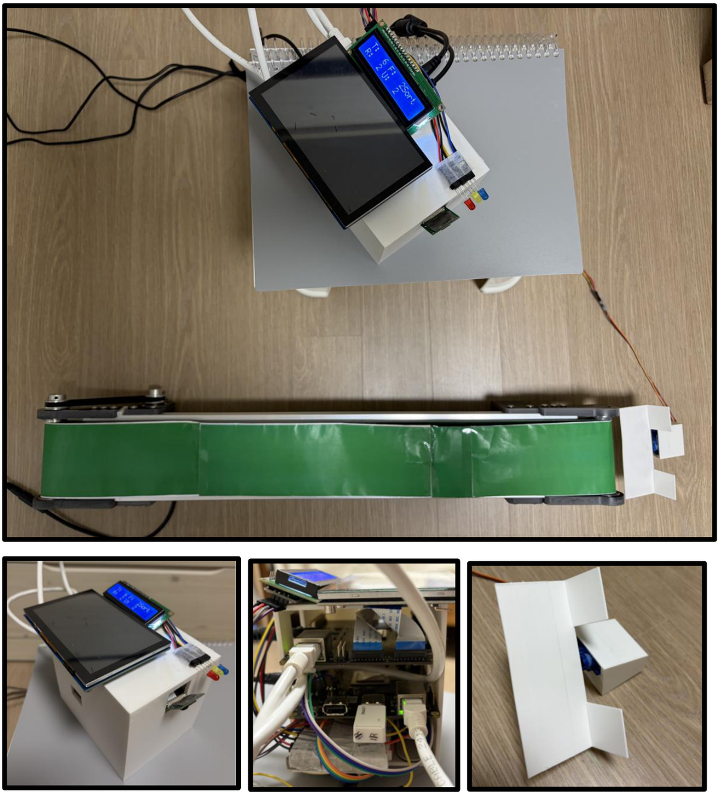
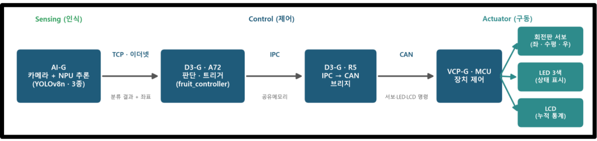
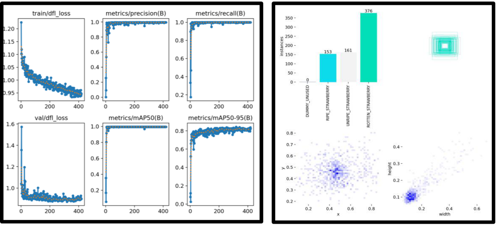
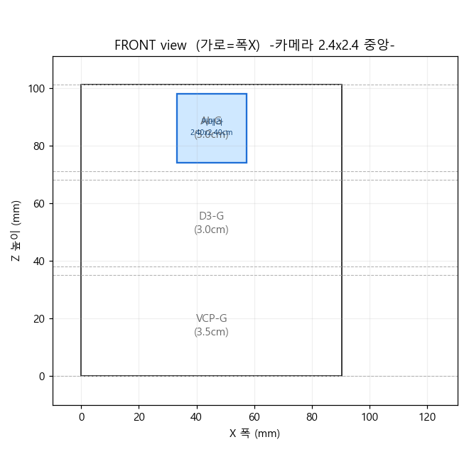
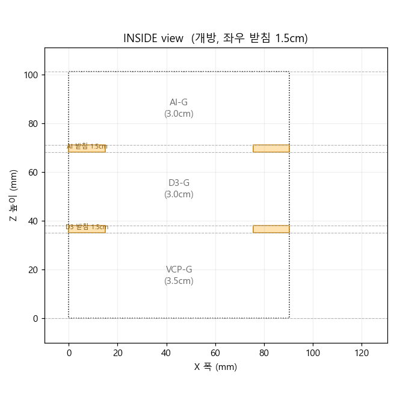
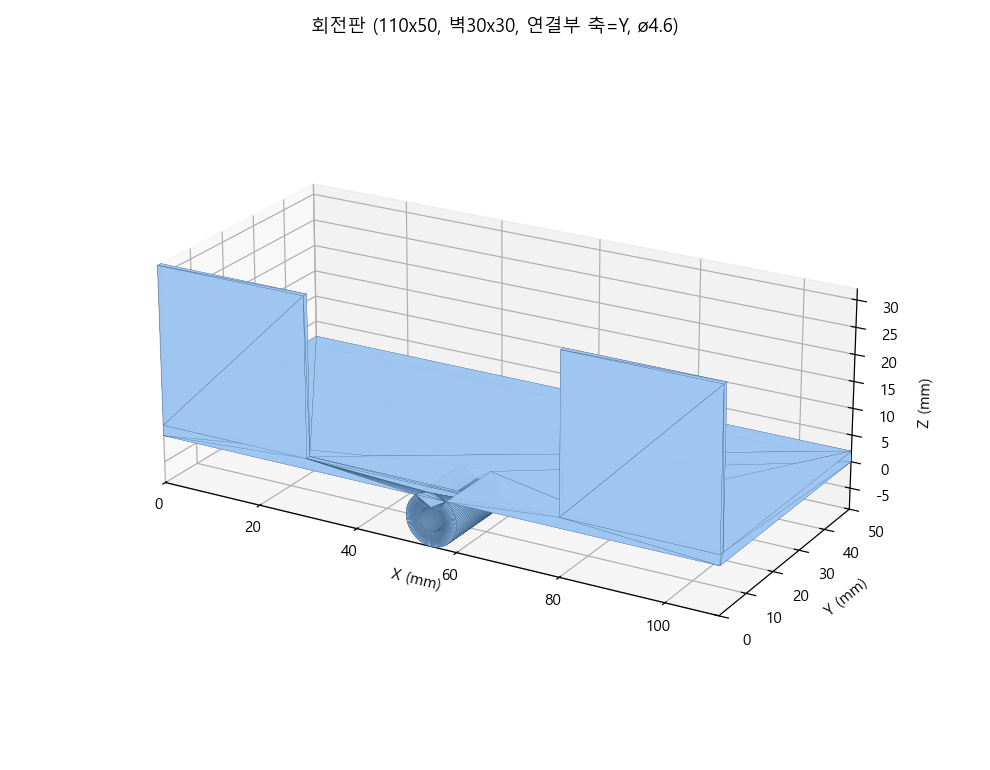
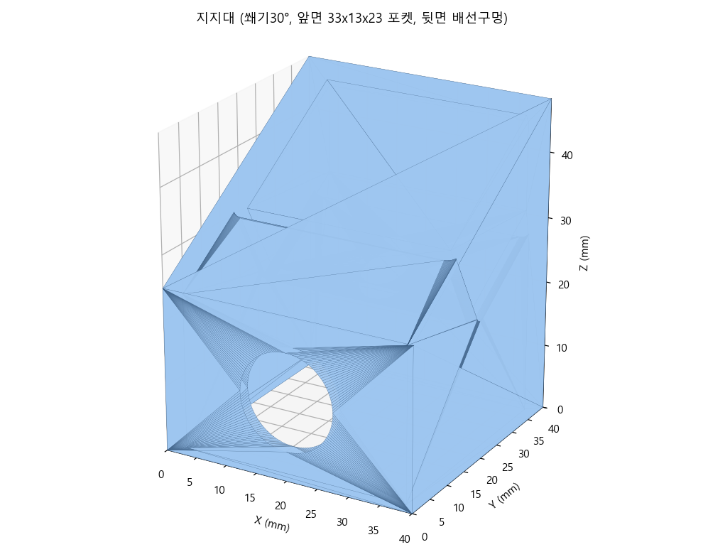
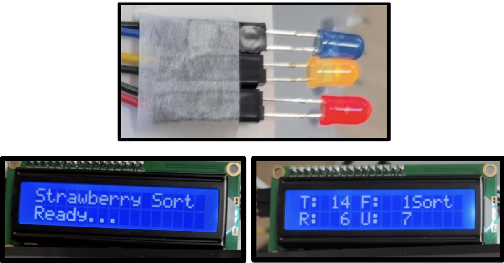
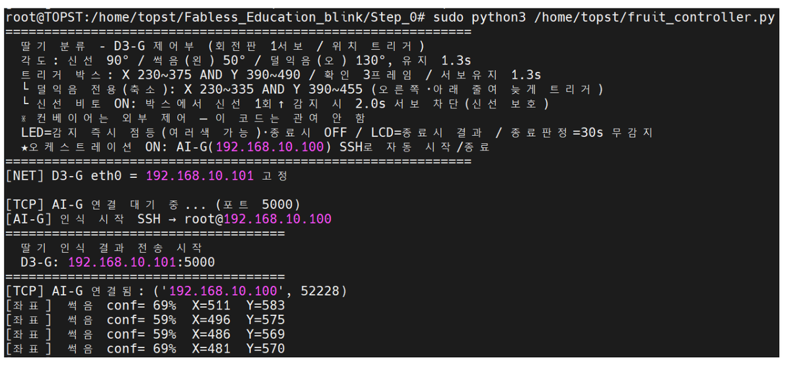

# Strawberry Sorting System

> Three embedded boards — different chips, different operating systems, different languages —
> tied into one sorting line.

A camera and an NPU classify strawberries moving along a conveyor as fresh, unripe or rotten,
and a rotating plate at the end of the belt discharges each class. The communication chain —
Ethernet TCP → IPC shared memory → CAN — was designed from scratch, and at two frames per
second with frequent misdetections the line still actuates **exactly once per strawberry**.
The whole line starts from a single SSH command; no UART cables remain.

[한국어](README.ko.md)



---

## Contents

- [Background](#background)
- [System](#system)
- [Design](#design)
- [Repository structure](#repository-structure)
- [Results](#results)
- [Build and run](#build-and-run)
- [Notes](#notes)

## Background

Each board owns a different layer. Recognition belongs on the NPU, decisions on Linux,
actuation on a real-time MCU. The problem was that the three can only speak in different ways.

AI-G runs a minimal Yocto image with no Python at all. D3-G has two cores running different
operating systems that must communicate through shared memory. VCP-G only accepts CAN frames.
Every hop uses a different mechanism, and making them mesh was most of the work.

## System



```
 camera --> [ AI-G ]  --Ethernet TCP-->  [ D3-G A72 ]
            YOLOv8n on                    classification gating, actuation timing
            the NPU                               |
                                                  | IPC shared memory
                                                  v
                                         [ D3-G R5, FreeRTOS ]
                                                  |
                                                  | CAN bus
                                                  v
                                         [ VCP-G ]  servo, LEDs, LCD
```

| Board | Role | Configuration |
|---|---|---|
| AI-G | Recognition | camera + NPU (8 TOPS), Yocto Linux, YOLOv8n |
| D3-G | Control | A72 (Linux) decides, R5 (FreeRTOS) relays shared memory onto CAN |
| VCP-G | Actuation | TCC70xx MCU, servo, three-colour LEDs, LCD |

With no Python on AI-G, result transmission is written in `sh` + `awk` + `nc`. The two D3-G
cores talk over `/dev/tcc_ipc_micom`, and from there to the actuation board it is CAN — one
byte for the servo angle, two for the LEDs, four for the LCD counter.

### Recognition model



YOLOv8n (about 3M parameters) was trained on a strawberry dataset we photographed and labelled
ourselves, reaching 0.99 validation mAP50. The lightweight model was chosen because the board
has 2 GB of memory. Dataset construction, training and NPU conversion were my teammate's work.

### Housing

| Exterior | Interior |
|---|---|
|  |  |

## Design

### Exactly once per strawberry

The camera runs at two frames per second and model misdetections are not negligible. Actuating
on detection means the plate turns several times for one strawberry, or turns for nothing on a
single frame of jittered coordinates. Five stages sit between detection and the servo.

| Stage | Rule |
|---|---|
| Confidence | ignore anything under 50% |
| Trigger box | both X and Y must fall inside the plate region |
| Debounce | three consecutive frames inside the box |
| Re-arm gap | that class must disappear for 1.5 s before it counts as a new strawberry |
| Non-blocking servo | triggers arriving mid-motion are dropped, not queued |

The last one came out of a failure. With a single plate, serialising servo calls behind a lock
meant excess triggers accumulated as 1.3-second motions and the plate kept turning over empty
belt long after the strawberry had passed. Making the lock non-blocking removed the backlog
rather than draining it.

### Three kinds of misdetection

A model with 0.99 validation mAP50 behaves differently over a real belt. The causes differ, so
the fixes did too.

| Problem | Cause | Fix |
|---|---|---|
| Detection too early and too twitchy | decision made on the Y coordinate alone | 2D box using both X and Y — accepted only right before the plate |
| Over-detection of unripe | most heavily represented in training, so detected every frame and triggering on box entry | a smaller box specific to unripe, with the entry edge moved inward |
| Fresh misclassified | fresh occasionally detected as rotten or unripe | one frame of fresh blocks other classes for 2 s |

That last fix came from watching the *direction* of the errors. Fresh being called defective
was common; defective being called fresh was rare. So the fresh signal is the trustworthy one,
and the logic is deliberately asymmetric: fresh fires on one frame while rotten and unripe
require three, so fresh always wins the race.

### Cable-free operation

Originally every board needed its own UART and its own commands. Now the control code starts
recognition on AI-G over SSH and tears everything down after 30 seconds with no detection. One
command does it.

Along the way: AI-G's IP was made persistent across reboots with a systemd service,
passwordless SSH keys were set up between boards, and NetworkManager was stopped from wiping
the static IP with `nmcli managed no`. The assumption that R5 needed a manual `log on` was
re-tested with a cold power cycle and turned out to be false — that is how the last UART cable
went away. The line now runs from cold boot over WiFi alone.

### Tuning without reflashing

Reloading the actuation firmware means WSL build → boot mode → FWDN → reboot, every time. So
everything tuned in the field lives in the Python controller instead: the three rotation angles,
hold time, trigger box coordinates, debounce frame count, re-arm gap. Changing one means copying
a file and rerunning. The camera moved more than once and the boxes had to be re-measured, so
this structure paid for itself.

### What the hardware taught

The plate started on an MG90S, which turned out to be a continuous-rotation servo — speed is
controllable, position is not. Timing the angle drifted every run, so it was replaced with a
positional SG90 and the target angle is now sent directly over CAN.

The LCD lit its backlight but showed no characters, and an I2C scan returned 0x00 at every
address. Attaching a scanner to both ports found nothing; the cause was wiring. It was connected
to pins this board cannot route I2C on. Moving it to the proper header and matching the firmware
port fixed it.

During wireless operation the LEDs and CAN logs were fine but the motor would not turn. That
isolated the CAN/R5/VCP path as healthy, leaving the servo wiring — insulating tape caught in a
jumper joint.

### 3D-printed parts

All three parts were modelled in CadQuery with every dimension as a named constant, and printed
on a Bambu X1-Carbon.

| Rotation plate | Support |
|---|---|
|  |  |

- **Housing** 96.5 × 123.5 × 107.0 mm, three boards on three shelves, with power, port and
  camera cutouts
- **Rotation plate** 110 × 50 × 1.3 mm with side walls, press-fits directly onto the SG90 spline
- **Support** holds the servo at 30 degrees to the ground so fresh strawberries roll through;
  includes a servo pocket and a wiring channel

The support was first modelled as a hollow shell, which produced a non-watertight solid the
slicer rejected. It became a watertight solid hollowed out by infill instead.

## Repository structure

```
BOARD_CODE/d3-g/
  fruit_controller.py        TCP server, classification gating, IPC transmission
  IPC_Example.py             IPC send CLI (A72 -> R5)
  IPC_Library.py             IPC packet construction + CRC16
BOARD_CODE/ai-g/
  ai_result_sender.sh        parses tcnnapp output -> TCP
  NPU_PIPELINE.md            training, conversion and deployment end to end
  sample_logs/               real detection logs per class
BOARD_CODE/vcp-g/
  app.can.demo/              CAN receive dispatch -> servo, LEDs, LCD
  app.base/                  entry point
  drivers/                   PWM, I2C/LCD, GPIO, CAN
  board_pinmap.md            GPIO names to physical connector pins
3d-model/
  model_file/                STEP and STL exports
  preview/                   renders of the three parts
docs/
  final_presentation_ko.pdf  final presentation
  final_report_ko.pdf        final report
  images/                    diagrams and operation screens taken from the final report
```

## Results

| | |
|---|---|
| Boards | three — 8 TOPS NPU (Yocto), dual-core control (Linux + FreeRTOS), MCU actuation |
| Communication | Ethernet TCP → IPC shared memory → CAN bus |
| Reliability | **exactly one actuation per strawberry** at 2 fps with frequent misdetections |
| Operation | whole line starts and stops from one SSH command; no UART cables |

### Operation

The result is shown immediately on three LEDs and an LCD — red for rotten, yellow for unripe,
green for fresh, all going dark after about a second. The LCD carries the idle state and the
running totals (all, fresh, rotten, unripe).



The run log after starting with a single command: the tuning constants, the fixed IP, the
automatic SSH start on AI-G, the TCP connection, and then detections with coordinates and
confidence.



## Build and run

**Prerequisites** — the Telechips TOPST SDK for building VCP-G firmware (built under WSL),
Python 3 on D3-G, and the trained model deployed on AI-G.

1. **Actuation board** — build `BOARD_CODE/vcp-g/` with the SDK and flash it with FWDN. Only
   needed again when the pin map or CAN format changes; all tuning parameters live in the
   controller.
2. **Recognition board** — place the three model files in
   `/usr/share/strawberry_shifted_v2_quantized/` and copy `ai_result_sender.sh` to `/home/root/`.
   The conversion and deployment process is in
   [`NPU_PIPELINE.md`](BOARD_CODE/ai-g/NPU_PIPELINE.md).
3. **Control board** — run `sudo python3 fruit_controller.py` on D3-G. With
   `ORCHESTRATE = True` it fixes its own IP, starts recognition on AI-G over SSH, and tears
   everything down after 30 seconds with no detection.

One-time setup: a static IP on AI-G, and a passwordless SSH key from the control board to AI-G.

## Notes

**My part** — this was a two-person project. I worked on the control and actuation boards, the
communication chain, system integration, field tuning and the final documentation. My teammate
handled the dataset, YOLOv8n training and the NPU deployment pipeline (including
`NPU_PIPELINE.md`). The 3D modelling was joint work.

**Not included** — course materials and dataset images are distributed content and are excluded.
